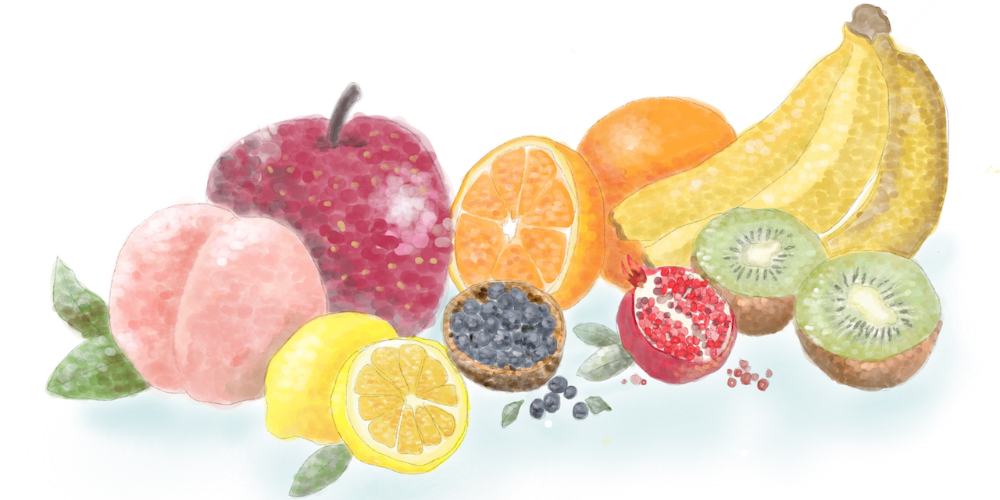

# Random Fruits name



[](https://github.com/shinshin86/random-fruits-name.js/actions/workflows/test.yml)

Generate the names of random fruits.

The name of fruits refers to this page.
[Wikijunior:Fruit Alphabet/Complete](https://en.wikibooks.org/wiki/Wikijunior:Fruit_Alphabet/Complete)

## Install

```bash
# npm
npm install random-fruits-name

# yarn
yarn add random-fruits-name

# pnpm
pnpm add random-fruits-name
```

## Usage

### React

```javascript
import React from 'react'
import getRandomFruitsName from 'random-fruits-name'

function App() {
  return (
    <div>
      <p>{getRandomFruitsName()}</p> {/* Apple - English is default language */}
      <p>{getRandomFruitsName('en')}</p> {/* Apple */}
      <p>{getRandomFruitsName('es')}</p> {/* Manzana */}
      <p>{getRandomFruitsName('ja')}</p> {/* りんご */}
      <p>{getRandomFruitsName('pt')}</p> {/* Maça */}
      <p>{getRandomFruitsName('nl')}</p> {/* Appel */}
      <p>{getRandomFruitsName('fr')}</p> {/* Pomme */}
      <p>{getRandomFruitsName('de')}</p> {/* Apfel */}
      <p>{getRandomFruitsName('cs')}</p> {/* Jablko */}
    </div>
  )
}

export default App
```

### Node.js

```javascript
const getRandomFruitsName = require('random-fruits-name')

console.log(getRandomFruitsName()) // Apple - English is default language
console.log(getRandomFruitsName('en')) // Apple
console.log(getRandomFruitsName('es')) // Manzana
console.log(getRandomFruitsName('ja')) // りんご
console.log(getRandomFruitsName('pt')) // Maça
console.log(getRandomFruitsName('nl')) // Appel
console.log(getRandomFruitsName('fr')) // Pomme
console.log(getRandomFruitsName('de')) // Apfel
console.log(getRandomFruitsName('cs')) // Jablko
```

### Deno

```typescript
import getRandomFruitsName from "https://esm.sh/random-fruits-name";

console.log(getRandomFruitsName()); // Apple - English is default language
console.log(getRandomFruitsName("en")); // Apple
console.log(getRandomFruitsName("es")); // Manzana
console.log(getRandomFruitsName("ja")); // りんご
console.log(getRandomFruitsName("pt")); // Maça
console.log(getRandomFruitsName("nl")); // Appel
console.log(getRandomFruitsName("fr")); // Pomme
console.log(getRandomFruitsName("de")); // Apfel
console.log(getRandomFruitsName("cs")); // Jablko
```

### Bun

```sh
# install
bun add random-fruits-name
```

```typescript
import getRandomFruitsName from "random-fruits-name";

console.log(getRandomFruitsName()); // Apple - English is default language
console.log(getRandomFruitsName("en")); // Apple
console.log(getRandomFruitsName("es")); // Manzana
console.log(getRandomFruitsName("ja")); // りんご
console.log(getRandomFruitsName("pt")); // Maça
console.log(getRandomFruitsName("nl")); // Appel
console.log(getRandomFruitsName("fr")); // Pomme
console.log(getRandomFruitsName("de")); // Apfel
console.log(getRandomFruitsName("cs")); // Jablko
```

## Languages Supported

| Languages  | Code Lang |
| ---------- | --------- |
| English    | en        |
| Spanish    | es        |
| Japanese   | ja        |
| Portuguese | pt        |
| Dutch      | nl        |
| French     | fr        |
| German     | de        |
| Czech      | cs        |

we are using [ISO-639-1 codes](https://en.wikipedia.org/wiki/List_of_ISO_639-1_codes) as code for differents languages

_you can make a Pull Request and add the language you want_

## Option

It is possible to specify opttion as the second argument.  
**Note that in this case, the language must be specified as the first argument.**

```javascript
getRandomFruitsName(lang, option)
```

Currently, there is an option called `maxWords`.

```javascript
getRandomFruitsName('en', { maxWords: 1 })
```

Which will ensure it will only return one word fruit name.

## Development

Please check out the [How to Contribute.](./CONTRIBUTING.md)

**Test**

```bash
npm run test
```

**Code format**

```bash
npm run fmt
```

## Contributors

Thanks to all contributors!

<a href="https://github.com/shinshin86/random-fruits-name.js/graphs/contributors">
  
</a>

Made with [contributors-img](https://contrib.rocks).

## Licence

[MIT](https://raw.githubusercontent.com/shinshin86/random-fruits-name.js/master/LICENSE)

## Author

[Yuki Shindo](https://shinshin86.com/en)
